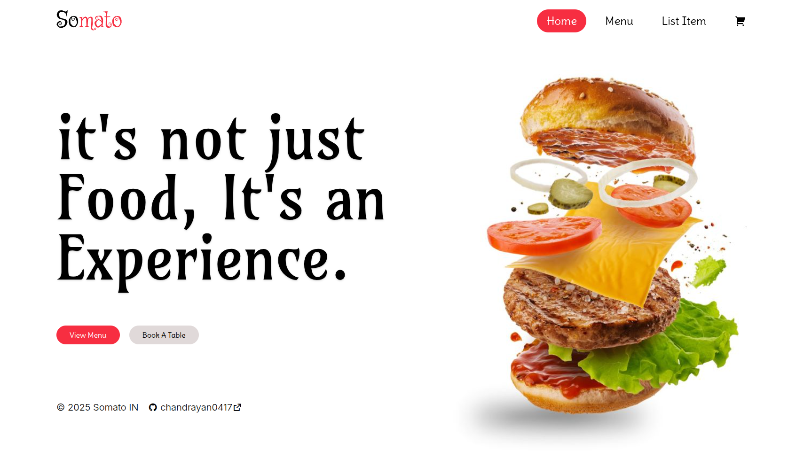
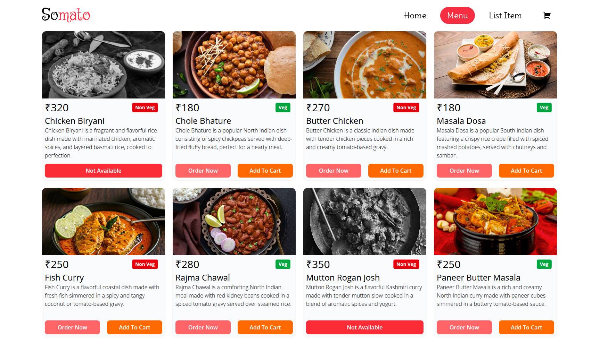
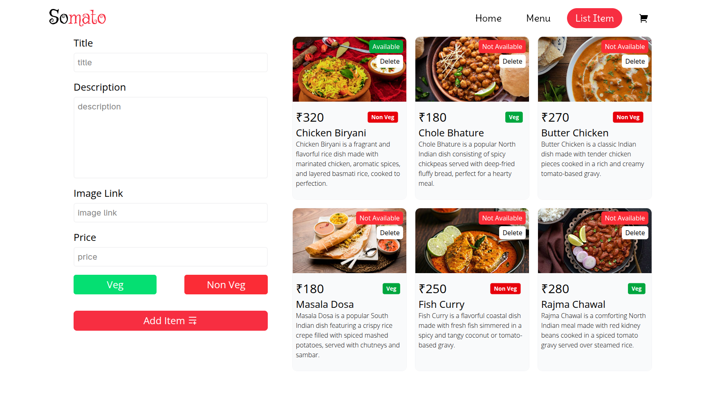
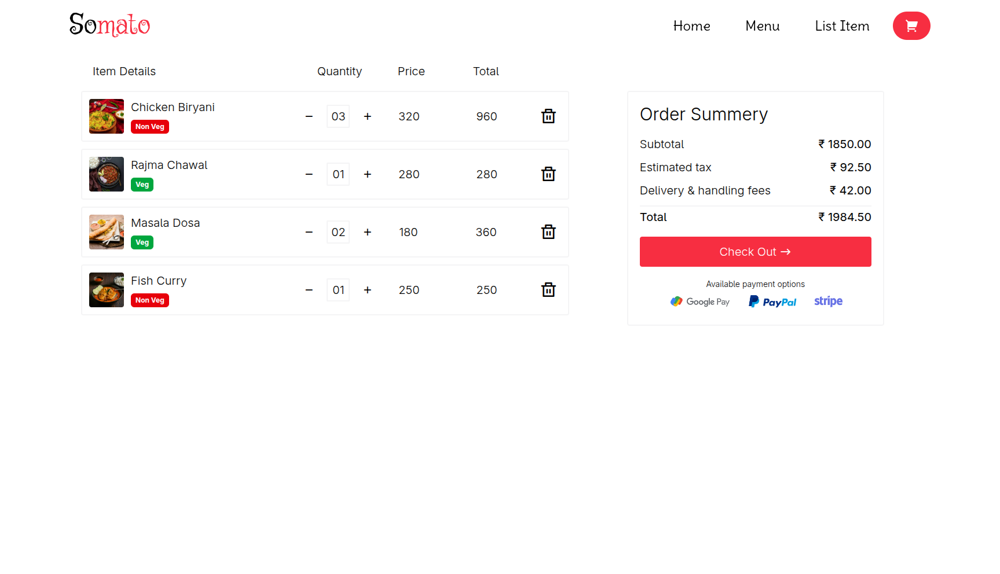

# 🍽️ Somato - Restaurant App

## 📦 Tech Stack

- **Frontend**: React
- **Styling**: Tailwind CSS
- **Routing**: React Router
- **Linting/Formatting**: [BiomeJS](https://biomejs.dev/)

---

## 🛠️ Setup Instructions

### 1. Clone the repository

```bash
git clone git@github.com:chandrayan0417/somato.git
cd somato
```

### 2. Install dependencies

```bash
npm install
```

### 3. Start the development server

```bash
npm run dev
```

---

## 📸 Preview





